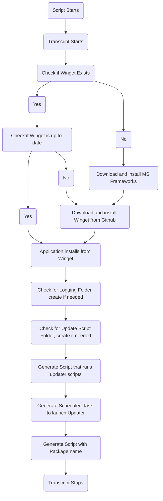

# Intune Win32 Apps

Winget changed everything, and now Intune apps are pretty reasonable to package and install (after some fiddling).

My Install.ps1 does a bunch of things. Set up your variables at the top, most importantly "PackageName". If you ```winget search``` whatever you're looking for, thats that package name. The script flows as so:

